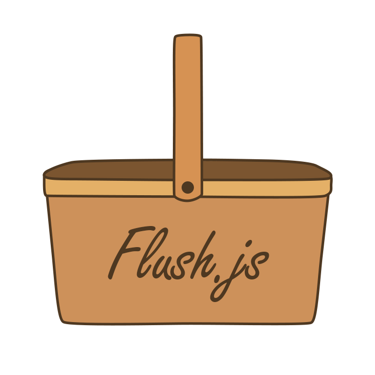
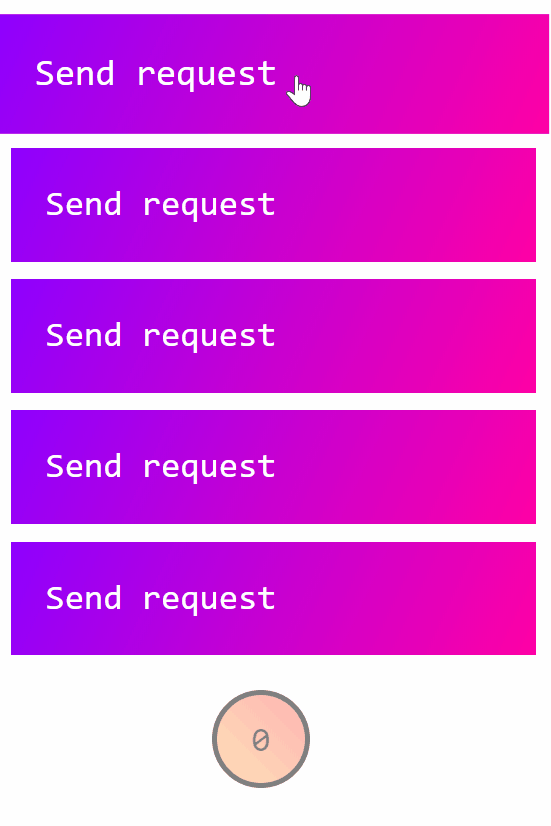

<p align="center">
  <a href="https://github.com/Alick09/Flush.js">
    
  </a>
  <p align="center">Automatization of collecting and repeating failed requests</p>
</p>

[![NPM version][npm-image]][npm-url] [![Downloads][downloads-image]][npm-url]

## What is Flush.js

Flush.js is a system which allows you to automatically collect all failed requests and then repeat all of them by single method. 


## How it works

Here is animation of how this tool can be used. Red borders means error (request cancelled), green card - successful response from the server and black - waiting for response. You can clone this repository and check out the demo to understand process better.




## Requirements

This tool uses **jquery** functions. So you need to include jquery before using this tool.


## Installation

You can use this tool using npm or just by downloading script and linking to the project.

For the first way you need to follow next steps:

- install the package using command `npm install flush-js --save-dev`
- use it inside you project like this: `var FlushJS = require('flush-js')`


For the second way you need to do:

- download `dist/flush.min.js` to your project
- include it using something like `<script type="text/javascript" src="../dist/flush.min.js"></script>`


## Usage

Here is very simple code of **Flush.js** usage.

```js
$('.request-sender').click(function(){
    FlushJS.send({
        url: "http://httpbin.org/get",
        method: 'GET'
    });
});

var $flushBtn = $(".flush-button");
FlushJS.onChange = function(e){
    $flushBtn.text(e.queueLength);
}

$flushBtn.click(function(e){
    FlushJS.flush()
})
```

- First 6 lines for setup click handlers. It's just a request send in jquery-ajax style. The only defference is that you must use **FlushJS** instead of **$**. So all failed requests will go to special queue.
- Next block makes interface a little responsive. Button for flushing contains number of failed requests and these lines just update this value.
- Last block of code just makes flush button work.


See demo. There you can find more complex and realistic usage.


## Additional properties, methods and handlers

- `timeout` - integer, milliseconds, 1000 by default. Change it if you want to work with slower or faster requests.

- `checkProblemIsConnection(xhr, status)` - useful function. Use it in **complete** or **error** methods when you call _FlushJS.send_ to understand will this request be lost or not.

- `queueLength()` - method which returns length of the queue.

- `onChange(e)` - change handler. Set it up (see demo) to make interface more responsive. event has multiple.

---

- `send(request)` - main method to make a request. Argument structure the same as in jQuery.ajax method.

- `flush()` - main method to repeat all failed requests.


[downloads-image]: https://img.shields.io/npm/dm/flush-js.svg
[npm-url]: https://www.npmjs.com/package/flush-js
[npm-image]: https://img.shields.io/npm/v/flush-js.svg